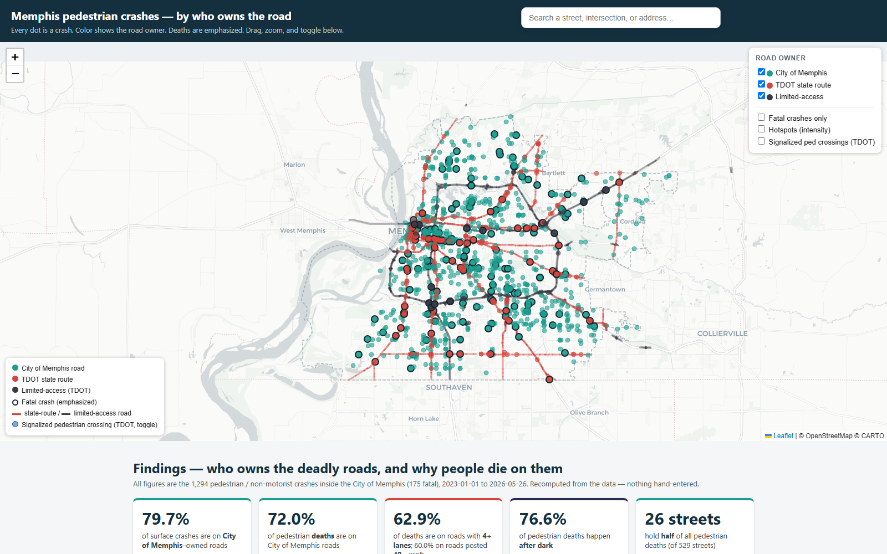

# Memphis Pedestrian Safety — *by who owns the road*

**An interactive map + data analysis showing that Memphis's pedestrian deaths concentrate on a small set of wide, fast arterials — reframing them as a systemic infrastructure problem, not individual error, and pinning down who owns those roads.**



> 🔗 **Live demo:** _deploying to Vercel — link coming soon._  In the meantime it runs locally in ~2 minutes → [**Run it locally**](#-run-it-locally).

---

## The problem

Memphis has one of the worst pedestrian fatality rates in the United States, and local coverage often frames each death as the victim's mistake — "jaywalking," "stepped into traffic." This project tests a different hypothesis with public data: that these deaths cluster on roads **engineered for speed and throughput**, and that the responsibility is therefore a *design* question. The first thing nobody had published a Memphis-specific number for: **who owns the deadly roads** — the City of Memphis, or the Tennessee Department of Transportation (TDOT)?

## Key findings

*All figures are computed from the data and reconcile to fixed totals — 1,294 pedestrian/non-motorist crashes inside Memphis, 175 fatal (2023-01-01 → 2026-05-26).*

- **~75–80% of crashes (and ~69–72% of deaths) are on City-of-Memphis roads; ~20–25% of crashes (28–31% of deaths) on TDOT state routes.** State arterials are over-represented in *deaths* relative to their crash share — i.e. deadlier per crash. Interstates and other limited-access roads add **35 more crashes (14 fatal)**, reported separately.
- **76.6% of pedestrian deaths happen after dark**; 14.3% on dark, *unlit* roads.
- The design signature: **62.9% of deaths are on roads with 4+ lanes** and **60.0% on roads posted ≥40 mph.** Just under half (49.7%) are on roads that are *both* — wide *and* fast.
- Deaths concentrate on a handful of corridors: **Poplar (44 crashes / 8 fatal), Union (36 / 8), Lamar (30 / 6), Winchester (28 / 5)** lead the ranking of 529 streets.
- **Proof of concept on Union Ave:** ~**1 in 5** crossing-related crashes happened **more than 250 ft from the nearest safe crossing**, and one **2,921 ft stretch (~9.7× the FHWA ~300 ft best-practice spacing)** has no crossing at all.

> The rigor is the point: every number is recomputed from raw data, reconciled to the fixed totals, and stated **descriptively** — the project never claims a road "causes" a death or that one road is "N× deadlier."

## What it does

- **Interactive map** — every crash as an individual dot, colored by road owner (City / TDOT state route / limited-access), deaths emphasized; layer toggles, a fatal-only filter, a "hotspots" intensity view, and a TDOT signalized-crossing layer.
- **Jurisdiction analysis** — a documented, rulebook-driven classifier tags every road segment by owner and attributes each crash to it, with per-crash provenance.
- **Signal & crossing layers** — the TDOT pedestrian-signal inventory plus OpenStreetMap crosswalks, with an along-corridor distance-to-crossing analysis.
- **Search** — type-ahead lookup of any corridor or any of the **25,533 street junctions citywide** (built from true geometric centerline intersection, with divided-arterial carriageways consolidated to one node), each with a clean stat card and map highlight; a junction with no recorded crashes returns an honest *"0 incidents reported here,"* never a blank. Address search is wired but pending a backend — see [roadmap](#-status--roadmap).
- **Findings dashboard** — charts and the deadliest-corridor table, all computed from the data.

## Methodology — how the data works

This is the real differentiator. Sources and provenance:

| Layer | Source |
|---|---|
| Pedestrian/non-motorist crashes | Tennessee **SAFETY MapServer** (TDOT), Layer 8 |
| State routes, city boundary, street centerlines | **City of Memphis Public Works GIS** |
| Pedestrian signals | **TDOT "ADA Asset Data"** |
| Crosswalks | **OpenStreetMap** via Overpass (ODbL) |
| Address geocoding | **US Census Bureau** geocoder |

Credibility principles baked into the pipeline:

- **Computed, never hardcoded** — every displayed figure is derived from the data files at build time.
- **Reconciled** — all jurisdiction/severity splits sum back to **1,294 crashes / 175 deaths**.
- **Correct geometry** — all distance math in **EPSG:32136** (NAD83 / Tennessee, meters); never Web Mercator (which stretches distance ~22% at this latitude).
- **Descriptive, not causal** — shares and distances only; no inflated "deadlier" claims.
- **Honest about coverage** — where signal/crossing data is incomplete, fields read **"not yet analyzed,"** never a fabricated number.

The jurisdiction classifier (`scripts/17_classifier.py`) tags each centerline segment by an **ordered rulebook** (interstate → ramp → limited-access override → state-route geometric overlap → completeness override → city residual) and records **which rule fired**, so every crash's classification is auditable.

---

## 🛠 Tech stack

- **Analysis:** Python · GeoPandas · Shapely · pyproj · pandas · NumPy
- **Front end:** Leaflet.js · Chart.js (self-contained HTML — the map embeds its own data)
- **Data/IO:** ArcGIS REST APIs · OpenStreetMap Overpass · US Census geocoder · python-docx
- **Tooling:** headless Chrome (render & verify) · Python venv

## 📁 Repo structure

```
scripts/         # numbered, reproducible pipeline (01–25): download → classify → analyze → build
data/
  raw/           # API downloads (geojson/csv); the 91 MB street network + page-dumps are .gitignored
  processed/     # deduped + classified crashes, the road-ownership rulebook, audit outputs
outputs/
  interactive_map/   # index.html (the app) + slim ownership geojson + search_index.json
  *.md               # audit & methodology reports (final numbers, completeness, OSM eval, Union POC)
docs/            # README assets
README.md · CLAUDE.md · requirements.txt
```

**Pipeline flow:** download crashes + roads → filter to the Memphis boundary → classify each crash by road owner (rulebook) → match to nearest named street + rank corridors → add signals/crossings → build the map, dashboard, and search.

## ▶ Run it locally

```bash
# 1. set up the environment
py -m venv .venv
.\.venv\Scripts\python.exe -m pip install -r requirements.txt

# 2. (optional) regenerate the large gitignored street network (~91 MB)
.\.venv\Scripts\python.exe scripts\05_download_streets.py

# 3. run the pipeline (scripts run in numeric order, 01 → 25); the key build steps:
.\.venv\Scripts\python.exe scripts\17_classifier.py          # classify crashes by road owner
.\.venv\Scripts\python.exe scripts\18_build_public_map.py    # build the map + dashboard
.\.venv\Scripts\python.exe scripts\25_rebuild_junctions.py   # rebuild every junction (true intersection)
.\.venv\Scripts\python.exe scripts\24_build_search.py        # add the search index + UI

# 4. view it — serve over http so EVERY feature works
.\.venv\Scripts\python.exe -m http.server 8000 --directory outputs\interactive_map
#    then open http://localhost:8000/index.html
```

> Serve it over `http://` (step 4), not by double-clicking the file — browsers block some features (like address search) on `file://`.
> `data/raw/memphis_streets.geojson` is gitignored to keep the repo light; script 05 regenerates it from the live API (so totals may shift slightly as the rolling ~3-year crash window advances).

## 🚦 Status & roadmap

- **Done:** jurisdiction classifier · interactive map + findings dashboard · corridor/intersection search · signalized-crossing analysis · Union Ave distance-to-crossing proof of concept.
- **In progress:** Vercel deployment (a live URL) + a small serverless geocode proxy so **address search** works in the browser (the Census API blocks direct browser calls).
- **Next:** live auto-refresh from the crash API · extend the crossing-distance analysis citywide (after OSM ground-truthing) · journalist/AI tools to draft corridor briefs from the data.

---

## Data sources, attribution & license

- **Crashes:** Tennessee SAFETY MapServer (TDOT) — public, no login.
- **Roads / boundary / streets:** City of Memphis Public Works GIS.
- **Pedestrian signals:** TDOT "ADA Asset Data."
- **Crosswalks:** © OpenStreetMap contributors, [ODbL](https://opendatacommons.org/licenses/odbl/).
- **Geocoding:** US Census Bureau geocoder.
- Developed in support of pedestrian-safety advocacy with **Street Fair Memphis** and **Innovate Memphis**.
- **License:** [MIT](LICENSE) for the code. Source data remains under its respective providers' terms.

## About

Built by **Samarth Desai**.

> I built this because Memphis's pedestrian deaths are too often written off as individual mistakes, when the data points to roads engineered in ways that make those deaths predictable. I wanted a tool that lets journalists and advocates *see* — and cite — where the responsibility actually sits.

- **Email:** [sdesai25@unc.edu](mailto:sdesai25@unc.edu)
- **LinkedIn:** [linkedin.com/in/samarthdesai06](https://www.linkedin.com/in/samarthdesai06)
- **GitHub:** [@sdesai25unc](https://github.com/sdesai25unc)
